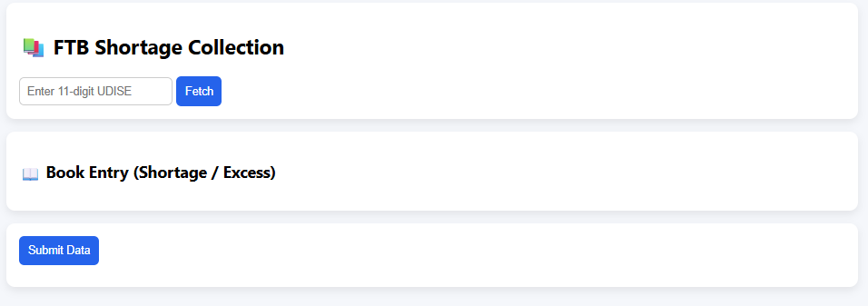
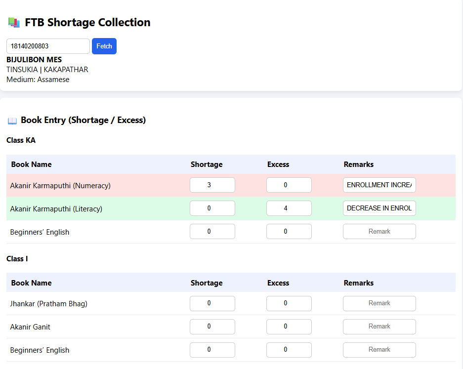
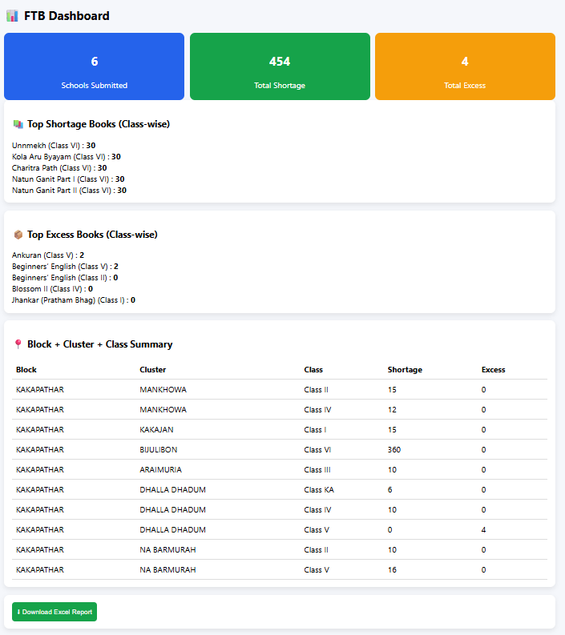

# FTB Shortage Collection — School Book Data App

[](https://lazymonkey12.github.io/school-app/)
[](#)
[](#)
[](#)

A lightweight Progressive Web App (PWA) built to streamline **Free Textbook (FTB) shortage data collection** from government schools across Assam. Designed for field use by CRCCs and teachers — fast, offline-capable, and mobile-first.

---

## 🔗 Live Application

**👉 [https://lazymonkey12.github.io/school-app/](https://lazymonkey12.github.io/school-app/)**

---

## 📋 Overview

This app eliminates paper-based data collection for FTB shortages. A field worker enters a school's UDISE code, the app auto-fills school details from a connected Google Sheet, then guides the user through entering shortage counts for each book — grouped by class and filtered by medium (Assamese / Hindi / Bengali). All data is submitted directly to Google Sheets.

---

## ✨ Key Features

| Feature | Description |
|---|---|
| 🔍 UDISE Auto-Fetch | Enter 11-digit UDISE → school details populate automatically |
| 📚 Medium-Filtered Books | Only shows books relevant to the school's language medium |
| 📊 Real-Time Total | Running total of all shortages updates as you type |
| 💾 Offline Mode | Data saved locally if no internet; syncs automatically when online |
| 🔒 Duplicate Guard | Warns if the same UDISE is submitted twice |
| 📱 Mobile-First | Optimized for low-end Android and iPhone devices |
| ⚡ Fast & Lightweight | No heavy frameworks — pure HTML/CSS/JS |
| 📲 Installable | Add to Home Screen on Android and iOS |

---

## 🖼️ Screenshots

| UDISE Entry | Book Entry Table|  Dashboard View |
|---|---|---|
|   |  |  |

---

## 🗂️ Project Structure

```
school-app/
├── index.html          → Main data collection app (all-in-one)
├── manifest.json       → PWA manifest (installability + icons)
├── sw.js               → Service worker (offline caching)
├── icon-192.png        → App icon (192×192)
├── icon-512.png        → App icon (512×512)
└── README.md           → This file
```

---

## ⚙️ How It Works

```
1. Open the app
2. Enter the school's 11-digit UDISE code
3. Tap "Fetch" → school name, district, block, cluster, medium auto-fill
4. Book list loads automatically based on school medium
5. Enter shortage count for each book (0 = no shortage)
6. Tap "Submit Shortage Data"
7. Data saves to Google Sheets instantly
```

If the device is offline, data is saved locally and syncs the next time the app is opened with internet.

---

## 🔧 Tech Stack

| Layer | Technology |
|---|---|
| Frontend | HTML5 · CSS3 · Vanilla JavaScript |
| Backend | Google Apps Script (Web App) |
| Database | Google Sheets |
| Hosting | GitHub Pages |
| Offline | Service Worker API + localStorage |

---

## 📱 Install as App (PWA)

### Android (Chrome)
1. Open the app link in Chrome
2. Tap the **⋮ menu** → **Add to Home Screen**
3. Tap **Install**

### iPhone (Safari)
1. Open the app link in Safari
2. Tap the **Share icon** → **Add to Home Screen**
3. Tap **Add**

### Desktop (Chrome / Edge)
1. Open the app
2. Click the **install icon** in the address bar
3. Click **Install**

---

## 🔗 Google Sheets Integration

### Sheet Structure

**Sheet 1 — `MASTER_SCHOOLS`**
| udise | school | district | block | cluster | category | management | medium |
|---|---|---|---|---|---|---|---|

**Sheet 2 — `MASTER_BOOKS`**
| medium | class | book |
|---|---|---|

**Sheet 3 — `SHORTAGE_DATA`** *(auto-created on first submission)*
| Timestamp | UDISE | School | District | Block | Cluster | Medium | Class | Book | Shortage |
|---|---|---|---|---|---|---|---|---|---|

### Setup Steps

**Step 1 — Create Google Sheet**
Create a new Google Sheet and add the two tabs above with your school and book data.

**Step 2 — Add Apps Script**
Go to **Extensions → Apps Script**, paste the backend `Code.gs` file, and update `SPREADSHEET_ID` with your Sheet ID (found in the Sheet URL).

**Step 3 — Deploy as Web App**
Click **Deploy → New Deployment**:
- Type: **Web App**
- Execute as: **Me**
- Who has access: **Anyone**

Copy the Web App URL (your Deploy ID).

**Step 4 — Connect to App**
In `index.html`, update the `CONFIG` block with your Deploy ID:

```javascript
const CONFIG = {
  SCHOOLS_API: 'https://script.google.com/macros/s/YOUR_DEPLOY_ID/exec?action=schools',
  BOOKS_API:   'https://script.google.com/macros/s/YOUR_DEPLOY_ID/exec?action=books',
  SUBMIT_API:  'https://script.google.com/macros/s/YOUR_DEPLOY_ID/exec?action=submit',
};
```

---

## 🚀 Deployment (GitHub Pages)

1. Create a GitHub repository
2. Upload: `index.html`, `manifest.json`, `sw.js`, `icon-192.png`, `icon-512.png`
3. Go to **Settings → Pages**
4. Source: **Deploy from branch → main → / (root)**
5. Click **Save**

Your app will be live at `https://YOUR-USERNAME.github.io/YOUR-REPO-NAME/` within 60 seconds.

---

## ⚠️ Important Notes

- File names are **case-sensitive** — use exact names as listed
- Apps Script must be deployed with access set to **"Anyone"** (not "Anyone with Google account")
- The `SHORTAGE_DATA` tab is created automatically on the first submission
- Book list is cached for 24 hours; school list is cached for 6 hours to reduce API calls
- Offline data is stored in browser localStorage and syncs automatically when internet is restored

---

## 👤 Author

**Sanjeev Kumar Gogoi**  

Data Analyst | Education Systems | Assam  
Working on data collection apps, dashboards, and automation  
Exploring machine learning and real-world data problems

---

## 🎯 Purpose

Built to support the **Free Textbook (FTB) distribution programme** in Assam by:
- Replacing paper-based shortage forms
- Reducing manual data entry errors
- Enabling real-time visibility for district and block officers
- Making data collection possible even in low-connectivity areas

---

*If this project helped you, consider giving it a ⭐ on GitHub.*
